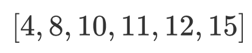
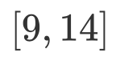
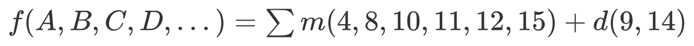
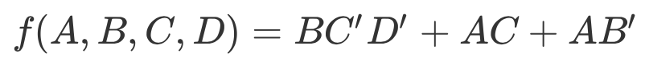

# Quine-McCluskey_Demo

This is a demo of Quine-McCluskey used Python.

## mind map

- input

  - A list of number, represents the logical expression to be simplified in Sum of Products form formula, like ;

  - Another list of number, represents Don't Care term in the logical expression, like ;

  - Then, the hole logical expression is: 

    

- output: a formula like ;

## method

### Step 1: Search "Prime Implicant"

Finding all prime implicants of the function.

### Step 2: Search "Minimum Cover"

Use those prime implicants in a *prime implicant chart* to find the essential prime implicants of the function, as well as other prime implicants that are necessary to cover the function.